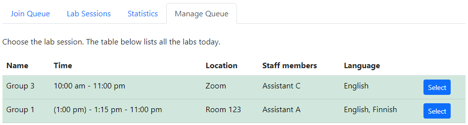
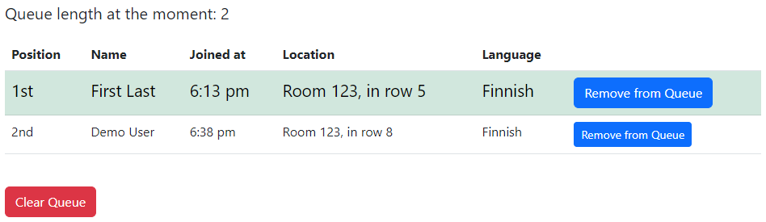

# Instructions for course staff members

## Managing the Queue

### Selecting the Queue

To start managing the queue, you need to first select the correct queue. By
selecting the Manage Queue tab, you will see a list of all sessions today.

The sessions which are currently going have a green background color and
sessions starting soon a light green background.

Select the correct session by clicking the Select button.

If the queue opens before the sessions officially begins, the time when the
queue opens is in parenthesis.

### Overview of the Queue

After selecting the correct session, a view showing all details of the queue
becomes visible.

You can see the students in the queue, when they joined the queue, which
instruction language they prefer and the row in which they are located. The
details of shown information depends on the course and session settings.

Also the given link for remote assistance is shown here for remote session
groups.

### Removing Students from the Queue

To remove students from the queue, click the corresponding button.

You can also remove students who are not in the first place but then there will
be a confirmation if you really want to remove that student to avoid
accidentally removing a wrong student.

If needed, you can use the button Clear Queue to remove all students in the
queue.

The previous student removed by using this computer will be shown on top of the
table with gray background color. You can always see the details of the student
there. In the another table in the bottom of the page, there is a list of all
recently removed students regardless if they were removed by using this or
another computer.

### Desktop Notifications

Neuvontajono can use desktop notifications to notify you when someone enters the
queue. This is useful if you are working with the computer at the same time and
don't want to miss new participants. This will use the notification system
provided by the operating system and notifications typically appear in the task
bar with a bubble and notification sound.

To enable the notifications, first you need to give a notification permission
for the browser by clicking the link in the top of the page. If the browser
doesn't show the dialog to allow the permission, check if there is a
notification symbol in the address bar and click it.

After the permission is given, the following text will appear.

You can use the link to disable the desktop notifications. Desktop notifications
are also automatically disabled if you activate the projector mode.

### Projector Mode

If there is a projector in the lab session room, you might want to use it to
show the queue status for the participants. Open the projector mode by clicking
the button Open Projector View.

The following view will open:

In most of browsers you can enable the full screen mode by pressing F11 key.

The view will show an analog clock in the left side and the queue length and the
next student in the queue in the right side of the view.

To remove a student from the queue, you can either click the name of the user or
simply press spacebar.

If specific pictures have been defined for the course to show hints etc. for the
exercises, these will replace the layout shown above. Then there will be a big
picture in the bottom of the screen and the queue details are shown in the top
row of the view. Otherwise the projector mode works in the same way.

## Switching Sessions

You can always select another session to be managed. However, as long as the
sessions will continue in the same location, you don't have to change the
session.

Technically, you are always managing the queue in the specific location and the
selected session will only define the location. Therefore, if there are many
sessions after each other in the same room, you don't have to pay any attention
to when a session starts or ends and change the selected session.
