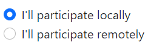
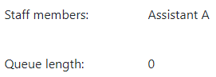
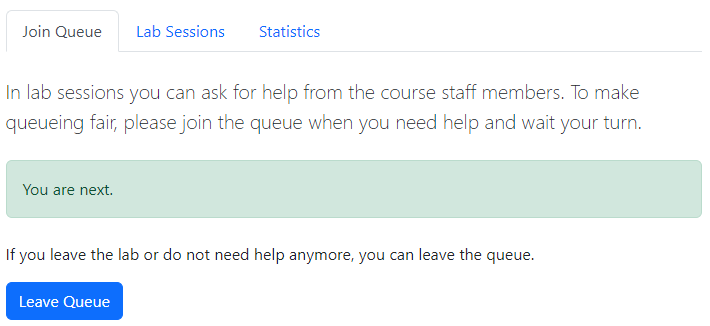

# Instructions for students

## Joining the queue

When the queue is open, joining the queue can be done in the Join Queue tab.
Below is an example of the view but the actual appearance depends on the course
settings and the currently running lab sessions.

All the different variations are explained in the following sections. Not all of
these options are visible if they are not needed.

### Selecting Participation Mode

In case that there are at the same time local and remote sessions, you need to
select in which type of session you are participating.

After this selection, only the sessions of that type are shown.

### Selecting the Correct Session

If there are multiple sessions at the same time, next you need to select the
correct session based on its location. Use the drop-down menu to select the
session in which you are participating.

When the session is selected, all the details below are related to this session
(such as the queue length, assistants etc.).

### Queue Details

In the middle of the view, the names of the course staff members (if defined)
and the current queue length are shown.

### Language, Row Selection, and Joining a Local Queue

Next you need to select which language is the preferred for the assistance. This
option is available only if the staff members can speak multiple languages.

To make it easier for the course staff members to locate you in the room, pick
the correct row. Then click Join Queue and you have been added to the queue.

### Joining a Remote Queue

If you are participating a remote session, the view is a bit different than
shown above. Instead of defining a row, there is an input field for a video
connection address. Type a Zoom link or some other link depending on the tools
used for remote assistance. The course staff members will use this address to
connect with you when it is your turn.

Please note that the given address must start with `http://` or `https://`.

If you leave this empty, staff members will only see your name and email
address.

Click Join Queue button after filling the information and you will be added to
the queue.

## Current Position in the Queue and Leaving the Queue

When you are in the queue, you will always see your current position in the
queue in the Join Queue tab.

When is your turn, you will be automatically removed from the queue. However, if
you don't need help anymore, you can always click the Leave Queue button and you
will be removed from the queue.

## Changing Row or Session

If you change your row or you didn't get your turn before the session ended and
there will be another session, you can update your location by clicking this
link in the bottom of the Join Queue page:

It will open the same form when you enter the queue but now it will only update
your information and your original time of entering the queue will remain the
same.

If the next session is in the same location as the previous, there is no need to
use this functionality because you will stay in the queue as long as the
location is the same.

## Sign Up

Depending on the course settings, local lab sessions may require you to sign up
before you can join the queue. You will see the following message and button if
this is required.

After signing up, the form to join the queue will appear.

## Sessions In This Week

You can see all the sessions during the current week by clicking the tab Lab
Sessions. It will show a table of the sessions and their details. All the
sessions within the current day have a green background color.

The details depend on which information has been entered to the system.
