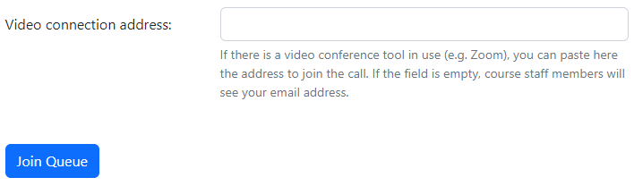
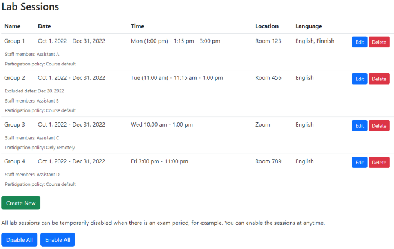

# Instructions for teachers

## Taking Neuvontajono into use

When Neuvontajono is launched for the first time for a new course in the course
management system, a new Neuvontajono instance is automatically generated. There
is no need to request a new instance from your system admins if they have
configured the required LTI settings in the course management system so that you
can add Neuvontajono as a part of your course in the CMS.

## Settings

As a teacher you can configure settings for your course by selecting the
Settings tab. Remember to save the settings by clicking Save in the bottom of
the page.

The following options are available:

**Course name**: The name of the course shown in the top of the page. The
default value for the name is taken from the initial launch of Neuvontajono from
the course management system.

**Additional URL**: If there is a separate page in the course management system
or elsewhere describing the lab sessions, you can put the address of the page
here. It will be shown as a link in Lab Sessions tab.

**Combine with**: If there are multiple course codes in use although they
basically share the same lab sessions, it is possible to combine Neuvontajono
instances so that only a single Neuvontajono is used for the all courses. Check
the correct Course id field above of that course which shall remain in use and
paste the value in this field.

After this setting is stored, all the other users except the course teacher are
redirected to the defined Neuvontajono instance.

**Video projector URL**: This optional URL can be given to override the default
projector view with a set of pictures. See
[the file format description](https://github.com/ttsirkia/neuvontajono#projector-configuration)
to more details how the configuration file should be constructed.

**Default UI language**: This option is valid only if the course management
system does not provide the preferred language. In this case the user interface
will use the language specified here.

**Default participation policy**: This setting defines the default value for the
sessions if it is possible to join the sessions only locally, remotely or both.
This value can be overridden for each session separately, if needed.

:warning: This option should not be changed after the sessions are defined. If
changed, the location of the sessions might get weird values unless you define
the location again for all sessions.

**Help message for remote participation**: You can use this setting to override
the default message for the purpose of the video connection address when joining
the queue. The default text is shown below.

There is also possibility to add session-specific help text which is shown after
the course-specific help text.

**Require to sign up in local lab sessions**: Selecting this option will show
the Sign up button for the students before they can join the queue. The option
can be used to collect the participants even if they won't join the queue but
are asked to sign up every time they are present.

:warning: This option has no effect if participant statistics are disabled as
this setting requires storing personal information of the participants.

**Visibility of statistics for participants**: This configures who can see the
statistics of how many participants there has been in each session each week. By
default this is enabled for all users. This will store personal information of
the participants and if this should be avoided, the feature can be disabled.

**Visibility of statistics for queueing**: This configures who can see the
statistics of queuing counts and waiting times. These statistics do not require
storing any personal information. By default only the course teacher is allowed
to see these statistics.

**Visibility of the queue length graph**: This configures who can see the graph
of queue length in each session. These statistics do not require storing any
personal information. By default only the course teacher is allowed to see these
statistics.

## Defining the Lab Sessions

In the bottom part of the page you can see a list of all sessions and buttons to
edit, delete and create new sessions.

In case that the queue opens before the session starts, the queue open time is
shown in parenthesis. Disabled sessions are shown as strikethrough text.

### Enabling and Disabling All Sessions

If you want to temporarily disable and then later enable all sessions again, you
can use the buttons in the bottom of the page. The change will be effective
immediately. This can be useful to disable the sessions during the exam weeks,
holiday periods etc. although defining the excluded days for the sessions is
probably an easier way to manage this.

### Settings for a Lab Session

Each lab session can have the following settings. Always remember to save the
settings in the bottom of the page to make them effective.

**Name**: A short name to distinguish the sessions.

**Default participation policy**: Use this option to override the course default
setting for participation mode, if needed.

**Location**: The location of the local lab session. You can specify multiple
locations by separating them with a comma. If you define multiple locations,
they will share the same queue and assistants. Use this if the resources are
shared. If there should be two separate sessions at the same time so that each
of them have their own staff members, create two lab sessions.

**Method for remote participation**: Write here the name of system which is used
for the remote assistance, such as Zoom or Teams. This is shown only for remote
sessions.

**Help message for remote participation**: If you need a session-specific
instructions for remote participation, you can enter the text here. It will be
shown after the course-specific help message or it will override the default
help text if the course-specific message is not defined.

**Staff members**: Use this optional field to define the course staff members.
Use comma to separate the members. The information is shown for the users but
does not have any functional purpose in Neuvontajono.

**Language of instruction**: You can define here in which language or languages
are used by the course staff members in this session. The language is shown for
the students. If you define more than one language separated with a comma, the
students need to select in which language they would like to get instructed.

**Weekday**: Select the correct weekday for this lab session.

**Start date**: Select the date when the sessions start. It can be any weekday,
the sessions will start on the next possible date if the selected date is not
the weekday of this session.

**End date**: Select the date when the sessions end. If the weekday does not
match with the selected weekday for this session, the sessions will end in the
last date which has the correct weekday and is before the end date.

**In use**: This option can be used to temporarily disable the session group.
Using the Enable all and Disable all buttons will change this setting for all
groups.

**Excluded dates**: If the lab session is not organized in each week within the
given date range, you can define here the dates to be excluded. Make sure to
select the dates again, if needed, after changing the weekday or the date range.

**Start time**: Define here the starting time of the lab session. Check the help
text below the input field how to format the time. The format depends on the
language of the user interface. By default, the queue opens at the same time
when the session starts.

**End time**: Define here the ending time of the lab session. It must,
naturally, be later than the start time.

**Queue opens**: If you want to open the queue before the session starts, you
can define here when the queue will open. It needs to open at latest at the same
time when the session starts.

This setting can be helpful if your sessions start always at quarter past and
end at sharp but you don't want to close the queue between the sessions. By
using this setting, you can define the queue to open at sharp and then the
students who will remain in the same location can enter the queue at any time
although the staff members would not be present.
